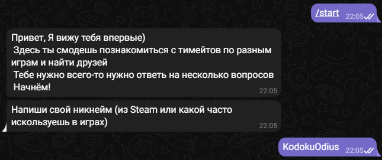
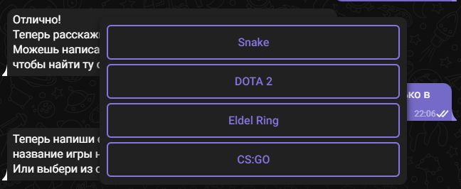
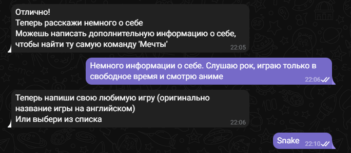
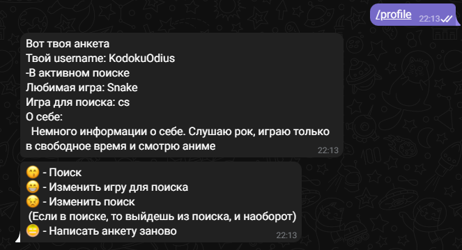
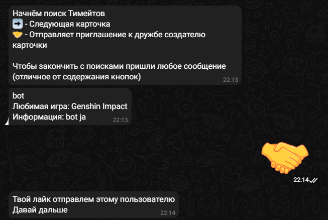

# TeleGameder
Micro Tinder Telegram Bot for gamers with using Django 

# В проекте были использованы инструменты:
Django, Django ORM (как связь с БД), aiogram

# Инструкция для проекты:
Чтобы весь проект работал корректно, достаточно в директории 'TeleGameder/TeleGameder' создать файл 'local_settings.py' и создать переменную с токеном для работы бота 'TOKEN'

Чтобы запустить бота необходимо прописать команду из директории 'TeleGameder/TeleGameder' (желательно в отдельном терминале) - 'python manage.py tg_bot'

# Инструкция по использованию Бота:

1) При Запуске бот проверяет id пользователя с данными из базы на совпадение. Если совпадений нет, то начинается регистация пользователя с использование StateGroup (aiogram)

2) После регистации открывается профиль уже зарегестрированного пользователя, откуда можно изменить данные или начать поиск тимейтов

3) При поиске будет 2 варианта:
    1. Отправить 'Привет'
    2. Следующая карточка

При первом варианте отправляется сообщение создателю карточки о том, что его карточка понравилась пользователю с ссылкой на пользователя (username)

При втором варианте присылается следующая карточка, из сохранённого множества, что означает что карточки не будут повторятся

Примечание:
    При выборе игры для поиска и в случае, если пользователей с такой игрой нет, попробуйте выбрать другую игру
    В случае затруднений с ботом: используйте меню бота или пропишите команду /help

# Дополнительные идея для проекта:
Оформление для сайта будет создаваться или на основе Bootstrap 5, или с помощью SCSS (CSS)  
На самом сайте будут также отображаться карточки (антекы) пользователей, с допольнительной кнопкой "Написать" через бота. Механизм будет реализован через реферальные ссылки (Пример: https://t.me/BOT/start=user_id)

Также можно добавть авторизацию через Telegram, чтобы проще взаимодействовать с ботом через сайт

В код бота можно добавить алгоритм добавления Игр для поиска, в случае если их нет в БД

На хостинг загрузить сайт и бота у меня не получилось, так как, к сожалению не работа с такими инструментами

Ну и точно такого же боты можно сделать и в вк с использование библиотеки 'vkbottle' - я знаком с API и с самой библиотекой